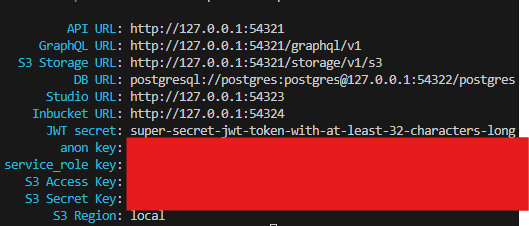

# Starting Development

## Guidelines

### New Features (New components, pages, etc)

1. Create a new branch
2. Work on that branch
3. Test if it works first
4. Merge request

### Database Schema Modifications (e,g. new tables)

1. Run this bash command to generate the migration file. Use a descriptive name like "create_orgs_and_students_tables".

    ```bash
    npx supabase db diff -f a_descriptive_name_for_your_change
    ```

2. Verifying the entire migration chain. A success means that you can probably push it. I think?

    ```bash
    npx supabase db reset
    ```

3. Commit to your branch. Of course replace the message with the suitable message.

    ```bash
    git add .
    git commit -m "feat: add posts table and rename org description"
    git push
    ```

4. Push to production (ONLY KEM SHOULD DO THIS. THIS WILL PUSH THE MIGRATION TO THE LIVE DATABASE)

    ```bash
    npx supabase db push
    ```

## Setup

### First time setup

#### Dependencies

1. Install [node.js](https://nodejs.org/en)
2. Install [Docker Desktop](https://www.docker.com/products/docker-desktop/)
3. Install [Supabase CLI](https://supabase.com/docs/guides/local-development/cli/getting-started?queryGroups=platform&platform=windows&queryGroups=access-method&access-method=studio)
4. Install Project Dependencies

    ```bash
    npm install
    ```

#### Local Environment Variables

1. Copy the contents of the .env.example to the .env.local. You could do this locally, but you can also do it in the CLI.

    ```Windows bash
    copy .env.example .env.local
    ```

    ```Mac/Linux bash
    cp .env.example .env.local
    ```

#### Starting Local Backend

1. Open Docker. Follow these settings.
   
2. Run local supabase. Should take a while for the first run. Wait for a few mins.

    ```bash
    supabase start
    ```

3. If it is successfull, it should show this screen. You can modify the database schema in the Studio which you can access from the Studio URL given.
   
4. Copy the local keys to the .env.local

    ```.env.local
    NEXT_PUBLIC_SUPABASE_URL="YOUR_LOCAL_OR_PROD_SUPABASE_URL"
    NEXT_PUBLIC_SUPABASE_ANON_KEY="YOUR_LOCAL_OR_PROD_SUPABASE_ANON_KEY"
    SUPABASE_SERVICE_ROLE_KEY="YOUR_LOCAL_OR_PROD_SUPABASE_SERVICE_ROLE_KEY"
    ```

#### Sync the Database Schema

1. Run the reset command to wipe the local database and rerun all migrations in chronological order.

    ```bash
    supabase db reset
    ```

#### Run the Frontend Application

1. Run this command after everything is fine. This will start the development server that you can access locally or within your network.

    ```bash
    npm run dev
    ```

2. Should generate two links. One for your local machine and one for your network where you can access it from any device as long as it is connected to your network.
