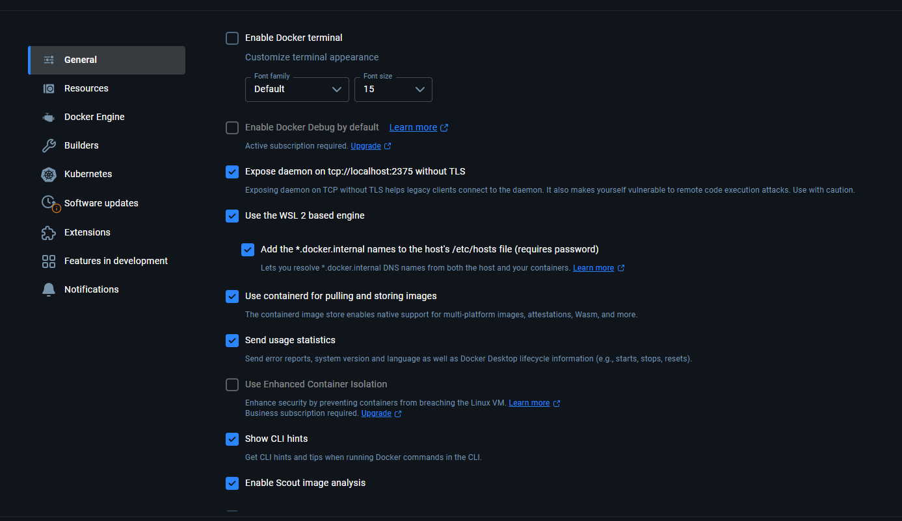

# Starting Development

## Guidelines

### New Features (New components, pages, etc)

1. Create a new branch
2. Work on that branch
3. Test if it works first
4. Merge request

### Database Schema Modifications (e,g. new tables)

1. Run this bash command to generate the migration file. Use a descriptive name like "create_orgs_and_students_tables".

    ```bash
    npx supabase db diff -f a_descriptive_name_for_your_change
    ```

2. Verifying the entire migration chain. A success means that you can probably push it. I think?

    ```bash
    npx supabase db reset
    ```

3. Commit to your branch. Of course replace the message with the suitable message.

    ```bash
    git add .
    git commit -m "feat: add posts table and rename org description"
    git push
    ```

4. Push to production (ONLY KEM SHOULD DO THIS. THIS WILL PUSH THE MIGRATION TO THE LIVE DATABASE)

    ```bash
    npx supabase db push
    ```

## Setup

### First time setup

#### Dependencies

1. Install [node.js](https://nodejs.org/en)
2. Install [Docker Desktop](https://www.docker.com/products/docker-desktop/)
3. Install [Supabase CLI](https://supabase.com/docs/guides/local-development/cli/getting-started?queryGroups=platform&platform=windows&queryGroups=access-method&access-method=studio)
4. Install Project Dependencies

    ```bash
    npm install
    ```

#### Local Environment Variables

1. Copy the contents of the .env.example to the .env.local. You could do this locally, but you can also do it in the CLI.

    For Windows

    ```Windows bash
    copy .env.example .env.local
    ```

    For Mac/Linux

    ```Mac/Linux bash
    cp .env.example .env.local
    ```

#### Starting Local Backend

1. Open Docker. Follow these settings.
   
2. Run local supabase. Should take a while for the first run. Wait for a few mins.

    ```bash
    supabase start
    ```

3. If it is successful, it should show this screen. You can modify the database schema in the Studio which you can access from the Studio URL given.

    ```Output
    API URL: 
    GraphQL URL: 
    S3 Storage URL: 
    DB URL: 
    Studio URL: 
    Inbucket URL: 
    JWT secret: super-secret-jwt-token-with-at-least-32-characters-long
    anon key: 
    service_role key: 
    S3 Access Key:
    S3 Secret Key:
    S3 Region: local
    ```

4. Copy the local keys to the .env.local

    ```.env.local
    NEXT_PUBLIC_SUPABASE_URL="YOUR_LOCAL_OR_PROD_SUPABASE_URL"
    NEXT_PUBLIC_SUPABASE_ANON_KEY="YOUR_LOCAL_OR_PROD_SUPABASE_ANON_KEY"
    SUPABASE_SERVICE_ROLE_KEY="YOUR_LOCAL_OR_PROD_SUPABASE_SERVICE_ROLE_KEY"
    ```

5. When you are done using the local database, remember to stop the database.

    ```bash
    supabase stop
    ```

#### Sync the Database Schema

1. Run the reset command to wipe the local database and rerun all migrations in chronological order.

    ```bash
    supabase db reset
    ```

#### Run the Frontend Application

1. Run this command after everything is fine. This will start the development server that you can access locally or within your network.

    ```bash
    npm run dev
    ```

2. Should generate two links. One for your local machine and one for your network where you can access it from any device as long as it is connected to your network.

### Daily Routine

When everything is already set up and installed, this would be your usual workflow:

#### When creating a new feature (Example: creating an organization header component)

##### Preparation

1. Sync with the main branch

   ```bash
   git checkout main
   git pull origin main
   ```

2. Create a new Feature Branch (adding feature/, fix/, docs/ as prefixes of branch name is good practice)

    ```bash
    git checkout -b feature/example-component
    ```

3. Add the local branch to the remote

    ```bash
    git push --set-upstream origin feature/button-component
    ```

##### Development

###### With no interaction with the backend (database)

1. Create the component. Make sure it is under the components directory.
2. Write the code.
3. Make sure to test it using the dev server.

    ```bash
    npm run dev
    ```

4. Commits MUST NOT BE IN BATCH. Below is an example.

    ```bash
    # First, add the new file to Git's tracking
    git add src/components/organizations/OrganizationHeader.tsx

    # Commit the initial structure
    git commit -m "feat: create initial structure for OrganizationHeader component"

    # ... after adding styles and props ...
    git add .
    git commit -m "feat: add styling and props to OrganizationHeader"
    ```

    So it must be Code -> Test -> Commit, until it is ready to go.

###### With interaction with the backend (database)

1. Create the component. Under the components directory.
2. Add the "use client" directive. The component that involves interactivity are client components cuz they need to use hooks.

    ```tsx
    # For example the path of this component is at  src/components/organizations/SubscribeButton.tsx
    "use client";

    # Rest of the code here
    ```

3. Write the code.
4. Write the server action. It is a special function that will run on the server for security. It uses the "use server" directive.

    ```tsx
    # For example the path of this action is at  app/organizations/[orgId]/actions.ts, it is good practice to put it near the page that uses them
    "use server"

    # Rest of the code here
    ```

5. Call the server action from the component that uses it.
6. Like the instruction above, commit your work in logical steps pls.

    For example:

    ```bash
    git add . # Actually specify the file here.
    git commit -m "feat: create subscribe server action"
    git commit -m "feat: create SubscribeButton client component"
    git commit -m "feat: wire up subscribe button to server action"
    ```

##### Integration

1. Sync with main first to make sure their would be no merge conflicts.

    ```bash
    # Fetch the latest changes from the remote
    git fetch origin

    # Merge the latest main branch into your feature branch
    git merge origin/main
    ```

2. Push the local Feature Branch to the Remote Repository

   ```bash
   git push -u origin feature/org-header-component
   ```

3. Create a Pull Request
   1. Go to GitHub.
   2. Go to the branch and then press the "Compare & Pull Request" button.
   3. Write clear title and description.

   Example:

   Title: feat: Add Organization Header Component
   Description:
   - What does this PR do? "Creates a new reusable component for displaying the organization's banner, profile picture, and name."
   - How to test: "Go to any organization's page to see the new header."
   - Screenshot: A screenshot showing the new component being used in the webpage.
